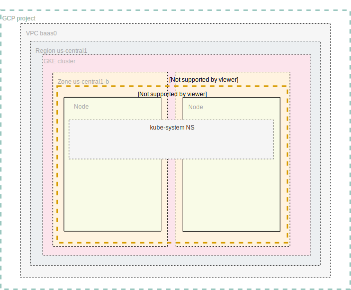

Here is quick HOWTO use terragrunt with multiple environments.

Requirements: 
* git
* [terraform](https://www.terraform.io/downloads.html)
* [terragrunt](https://github.com/gruntwork-io/terragrunt#install-terragrunt)
* [gcloud](https://cloud.google.com/sdk/install) 
* kubectl (version from gcloud is ok)
* [helm](https://helm.sh/docs/using_helm/#installing-helm)
* Please follow "Before you begin" part of [GCP manual](https://cloud.google.com/kubernetes-engine/docs/how-to/iam)

Terragrunt allows to store terraform manifests separately from terraform [sensitive] values and support multiple environments.

In this [example](examples) we have 3 envs - dev,staging, and prod.
Adjust all the `terragrunt.hcl` files to suit your environments.
Let's deploy staging env. Start from infra deployment.
* Init
```bash
cd examples/live/staging/infra
terragrunt init
```
* Check terraform plan
```bash
terragrunt plan
```
* Apply changes, it takes some time, 10-30min
```bash
terragrunt apply -auto-approve
```
We should get infrastructure similar to following scheme [](./images/tf0.svg)

Similar for basic preparations inside k8s
```bash
cd examples/live/staging/in-k8s
terragrunt init
terragrunt plan
terragrunt apply -auto-approve
``` 

* Destroy all the staff, when required

```bash
cd examples/live/staging/infra
terragrunt destroy
```
